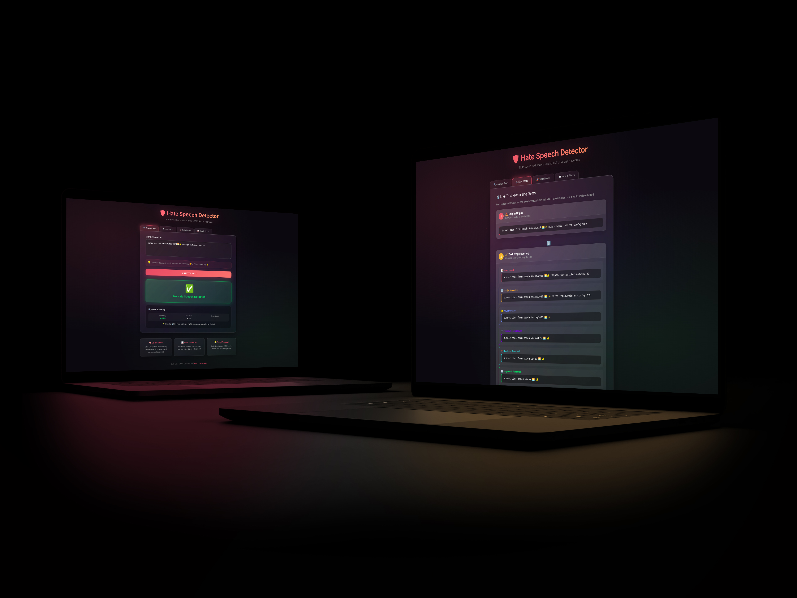

## About the Project

This is my Final Project for COMP 4750: Natural Language Processing at Memorial University of Newfoundland.

## What It Is & The Problem It Solves?

Online platforms are flooded with toxic content including hateful comments, abusive messages, and harmful speech that can hurt real people. Manually reviewing millions of posts is impossible and traditional keyword filters are easy to bypass. People just misspell words or use emojis to hide their intent.

I built a Hate Speech Detector that uses Deep Learning to automatically identify hateful or abusive text in real-time. The cool part? It understands context, not just keywords. So "I hate Mondays" won't be flagged, but actual abusive content will. It even catches hate speech hidden in emojis like "😡🔪", something most filters completely miss.

## Demo:

## How It Works?

When you visit the hate speech detector, you are greeted with a web interface where you can type or paste any text. Maybe a tweet, a comment, or even something with emojis like "I hate those people 😡🔪." The moment you hit the analyze button, your text enters a Deep Learning pipeline designed to understand context, not just flag keywords. First, the text goes through preprocessing, where it gets cleaned in eight sequential steps: it is converted to lowercase, emojis get separated with spaces (so "😡🔪" -> becomes -> "😡 🔪"), URLs and special characters are stripped out, punctuation vanishes, numbers disappear, common filler words like "the" and "is" get removed, and finally every word gets reduced to its root form through stemming (so "hating" -> becomes -> "hate"). This cleaning is crucial because it standardizes the input. The model was trained on similarly processed text, so consistency matters.

Once your text is clean, it enters tokenization, where words get converted to numbers. The system uses a vocabulary of 50,000 unique words, each assigned a specific ID (like "hate" might be 42, "people" might be 891). Your sentence becomes a sequence of these numbers. But here is the catch. The LSTM neural network expects every input to be exactly 300 numbers long, so if your text has fewer tokens, zeros get added at the beginning until it reaches 300. If it is longer, it gets truncated. Now comes the Deep Learning magic. This numerical sequence flows through the Long-Short Term Memory (LSTM model), which has four layers. The embedding layer converts each number into a 100-dimensional vector that captures word relationships, then dropout layers help prevent overfitting, the LSTM layer with 100 memory units reads the sequence and remembers context (so it understands "I love you" versus "I'd love to hurt you" differently), and finally a dense layer with sigmoid activation outputs a single probability between 0 and 1. If that number exceeds the given threshold (0.5), it is classified as hate speech. Below that, it is safe. The entire result: classification, probability score, and a breakdown of preprocessing steps gets sent back to your browser in under a second, displayed with color-coded results (red for hate, green for safe) and detailed metrics.

## How Model Training Works?

When someone clicks "Train Model", a completely different pipeline kicks in that takes several minutes to complete. The training pipeline starts by connecting to Google Cloud Storage and downloading two datasets totaling over 760,000+ labeled examples. One with traditional text-based hate speech and another focused on emoji-based abuse. These ZIP files get extracted locally, and the two datasets get merged into one massive DataFrame. After dropping unnecessary columns and removing rows with missing data, the combined dataset gets saved as transformed.csv. The system then configures GPU optimization (enabling mixed precision for faster training on NVIDIA cards), loads the data, and splits it 80/20 into training and testing sets. The training text goes through the same 8-step cleaning process used during prediction, then gets tokenized using a fresh Keras tokenizer that learns the 50,000 most common words. This tokenizer gets saved as tokenizer.pickle because we will need it later for predictions.

The LSTM model gets built from scratch with the four-layer architecture we discussed, compiled with binary crossentropy loss and RMSprop optimizer, and training begins, typically running for multiple epochs with a batch size of 256. During training, the model learns to associate patterns in the numerical sequences with hate/non-hate labels, constantly adjusting millions of internal weights to minimize prediction errors. Once training completes, the system saves the model as model.h5 and immediately enters the evaluation phase. This is where it gets smart. The system downloads the current best model from Google Cloud (if one exists) and runs both models on the same test set, calculating accuracy scores. If the newly trained model outperforms the existing best model, it gets accepted and uploaded to Google Cloud Storage, replacing the old one. If it does not improve, the upload is skipped, and you get a notification saying the new model was not good enough. This automatic comparison ensures only improved models make it to production. The entire process, from download to cloud upload, is fully automated, and the web interface keeps you updated with progress indicators and final results.

## Tech Stack:

#### Machine Learning & AI:

- TensorFlow and Keras (Deep Learning framework)

- LSTM Neural Network (Sequential pattern recognition)

- NLTK (Natural Language Processing toolkit)

- Scikit-learn (Data splitting and evaluation)

#### Backend:

- Python

- FastAPI (Modern API framework)

- Uvicorn (ASGI server)

#### Frontend:

- HTML5 / CSS3 (with glassmorphism design)

- Vanilla JavaScript

- Jinja2 Templates

#### Cloud & Infrastructure:

- Google Cloud Storage (Model and dataset hosting)

#### Development Tools:

- Jupyter Notebook (Experimentation and prototyping)

- Pandas (Data manipulation)

- Pickle (Model serialization)

#### Hardware Optimization:

- NVIDIA CUDA (GPU acceleration)

- Mixed Precision Training (For faster training on RTX GPUs)
